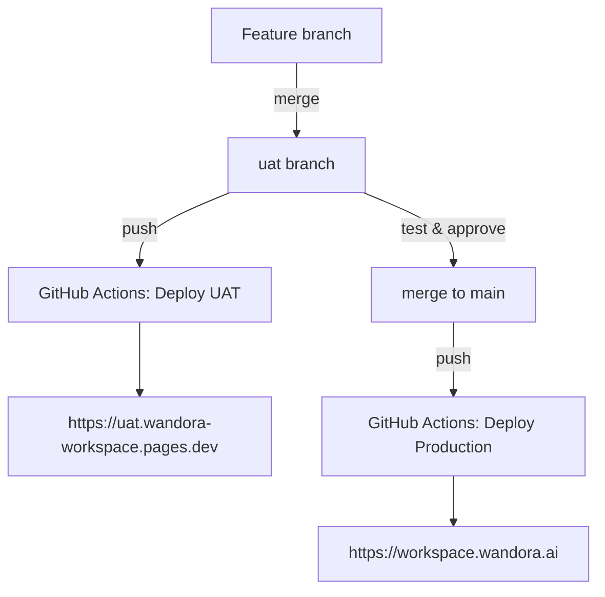

# Deployment Guide

This project uses a **two-branch deployment model**:

| Git branch | Environment | URL |
|------------|-------------|-----|
| `main` | **Production** | https://workspace.wandora.ai |
| `uat` | **UAT** (staging) | https://uat.wandora-workspace.pages.dev |

Pushing to either branch triggers an automatic deploy via GitHub Actions.

---

## URLs

| Environment | URL | Deployed from |
|-------------|-----|---------------|
| **Production** | https://workspace.wandora.ai | `main` branch |
| Production (Pages fallback) | https://wandora-workspace.pages.dev | `main` branch |
| **UAT** | https://uat.wandora-workspace.pages.dev | `uat` branch |
| GitHub repo | https://github.com/Wandora-AI/workspace_landing_page | — |
| GitHub Actions | https://github.com/Wandora-AI/workspace_landing_page/actions | — |

---

## How it works



**Typical workflow:**

1. Develop on a feature branch
2. Merge into `uat` → auto-deploys to UAT for testing
3. Once approved, merge `uat` into `main` → auto-deploys to production

The workflow file is [`.github/workflows/deploy.yml`](.github/workflows/deploy.yml).

| Push to branch | What happens |
|----------------|--------------|
| `main` | Deploys to **production** |
| `uat` | Deploys to **UAT** |
| Any other branch | Nothing (no deploy) |

---

## Deploy to production

Production always comes from the `main` branch.

### Via GitHub Actions (recommended)

```bash
git checkout main
git pull
git merge uat          # or merge your feature branch
git push origin main   # triggers production deploy
```

Monitor the run at [GitHub Actions](https://github.com/Wandora-AI/workspace_landing_page/actions).
Live at https://workspace.wandora.ai when the **Deploy Production** job succeeds.

### Manual deploy from your machine

```bash
cp .env.example .env   # set VITE_TEAM_PASSWORD, VITE_CONFIG_PASSWORD
npm run deploy
```

---

## Deploy to UAT

UAT always comes from the `uat` branch.

### First-time setup: create the `uat` branch

If the `uat` branch doesn't exist yet:

```bash
git checkout -b uat
git push -u origin uat
```

### Via GitHub Actions (recommended)

```bash
git checkout uat
git pull
git merge your-feature-branch
git push origin uat    # triggers UAT deploy
```

Monitor the run at [GitHub Actions](https://github.com/Wandora-AI/workspace_landing_page/actions).
Live at https://uat.wandora-workspace.pages.dev when the **Deploy UAT** job succeeds.

### Manual deploy from your machine

```bash
cp .env.example .env   # set VITE_TEAM_PASSWORD, VITE_CONFIG_PASSWORD
npm run deploy:uat
```

---

## Environment variables & secrets

### Build-time variables (embedded in the JS bundle)

| Variable | Used by | Set in |
|----------|---------|--------|
| `VITE_TEAM_PASSWORD` | Team password gate | GitHub Actions secrets + Cloudflare Pages env vars |
| `VITE_CONFIG_PASSWORD` | Config page password gate | GitHub Actions secrets + Cloudflare Pages env vars |

In Cloudflare Pages, set these under **Settings → Environment variables** for both **Production** and **Preview** environments.

### Runtime variables (Pages Functions only)

| Variable | Used by | Set in |
|----------|---------|--------|
| `CONFIG_PASSWORD` | `PUT /api/data` auth | Cloudflare Pages env vars (Production + Preview) |

### GitHub Actions secrets

**GitHub → Settings → Secrets and variables → Actions:**

| Secret | Purpose |
|--------|---------|
| `CLOUDFLARE_API_TOKEN` | API token with **Cloudflare Pages: Edit** permission |
| `CLOUDFLARE_ACCOUNT_ID` | Cloudflare account ID (dashboard sidebar) |
| `VITE_TEAM_PASSWORD` | Build-time team password |
| `VITE_CONFIG_PASSWORD` | Build-time config password |

---

## KV namespace bindings

The `/api/data` function stores workspace data in KV. Production and UAT use **separate namespaces** so UAT testing never affects production data.

**Cloudflare Pages → wandora-workspace → Settings → Bindings:**

| Cloudflare environment | Binding name | KV namespace |
|------------------------|--------------|--------------|
| **Production** | `WORKSPACE_KV` | `WORKSPACE_KV` |
| **Preview** (used by UAT) | `WORKSPACE_KV` | `WORKSPACE_KV_preview` |

The binding name is always `WORKSPACE_KV` — only the namespace behind it changes.

---

## Local development

```bash
cp .env.example .env
cp .dev.vars.example .dev.vars
npm install
npm run dev            # frontend only → http://localhost:5173
npm run dev:full       # frontend + API with KV
```

---

## Quick reference

```bash
# Deploy via git (recommended)
git push origin uat     # → UAT  (https://uat.wandora-workspace.pages.dev)
git push origin main    # → Prod (https://workspace.wandora.ai)

# Manual deploy
npm run deploy:uat      # → UAT
npm run deploy          # → Production
```
